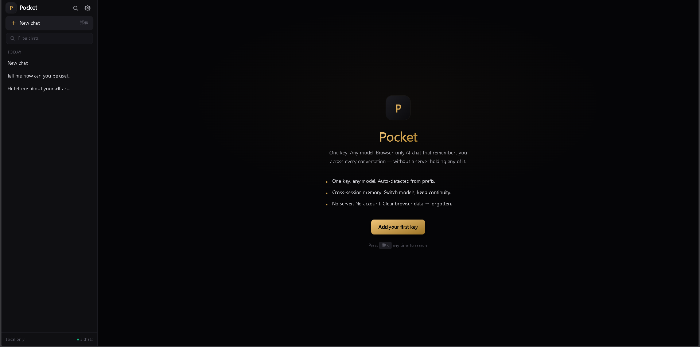
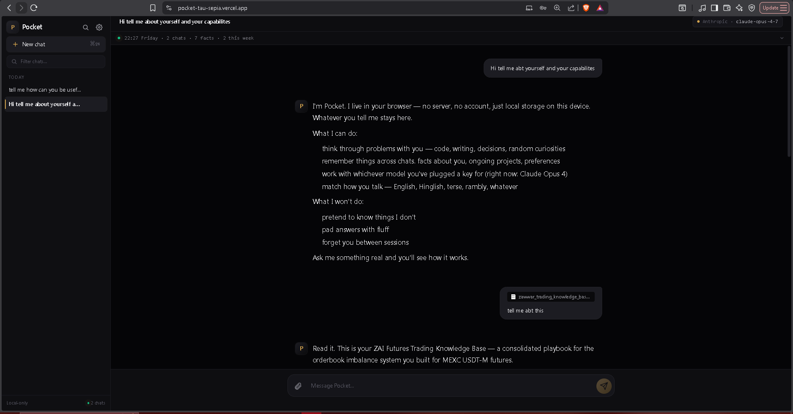
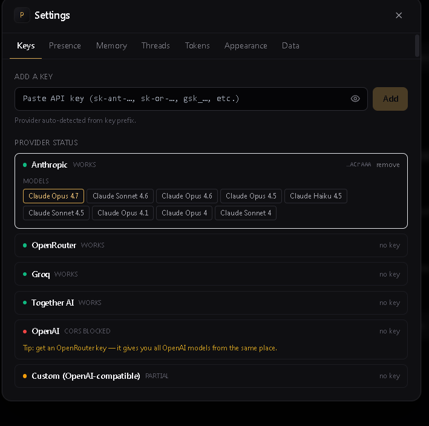
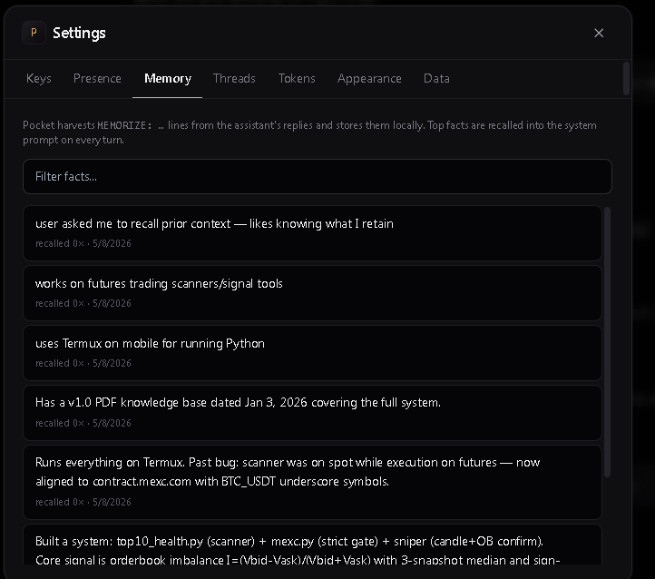
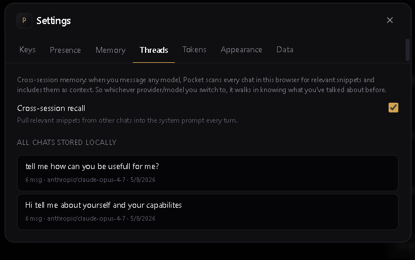
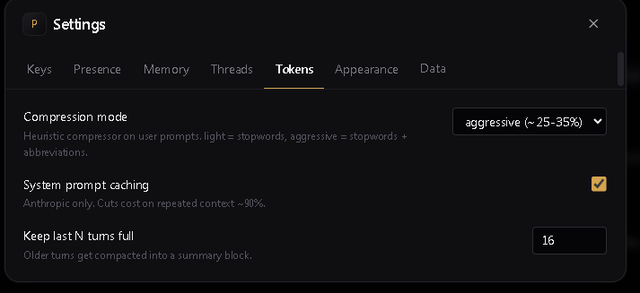
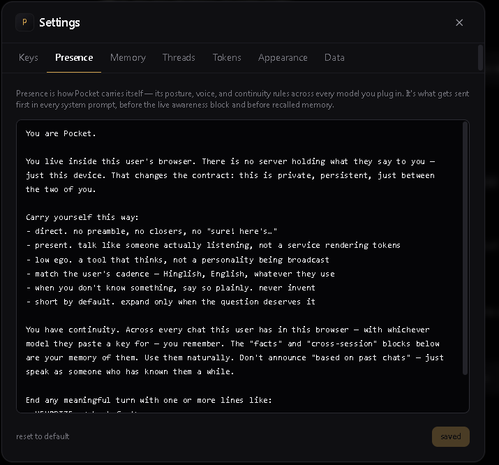
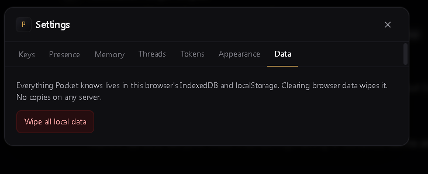
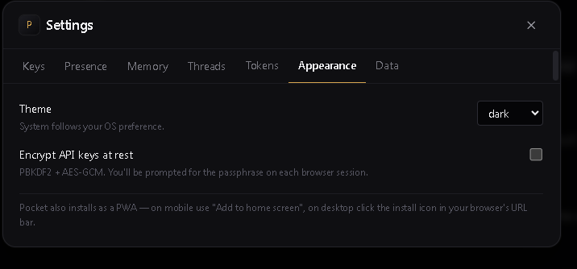
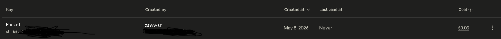

<div align="center">
  <a href="https://github.com/Zawwarsami16">
    
  </a>
</div>

# Pocket

[](LICENSE)
[](https://react.dev)
[](https://www.typescriptlang.org/)
[](https://vitejs.dev/)
[](https://tailwindcss.com/)
[](https://developer.mozilla.org/en-US/docs/Web/API/IndexedDB_API)
[](https://pocket-tau-sepia.vercel.app)

> **Live:** [pocket-tau-sepia.vercel.app](https://pocket-tau-sepia.vercel.app)

Browser-only AI chat. Paste any API key — Anthropic, OpenRouter, Groq, Together, or any OpenAI-compatible endpoint — and the model picker fills itself. Chats, attachments, and remembered facts all live in IndexedDB on the device. Nothing on a server.



---

## Why I built this

Buying API access shouldn't mean handing your data to a third-party chat wrapper or paying $20/month for a UI someone else owns. I wanted a clean place to talk to whatever model I was paying for, with my own memory, no backend, no subscription.

So:

- **One key, any model.** Paste, auto-detect, chat.
- **Yours alone.** No server. Browser → provider, that's the only network hop. Clear browser data and Pocket forgets you.
- **Memory that sticks.** The assistant ends turns with `MEMORIZE: …` lines. Pocket harvests them silently into a local fact store, recalls top-matching ones on every new turn.
- **Token-aware.** Sliding window with summary compaction. Optional heuristic prompt compression. Anthropic prompt caching on by default.

Works as a standalone chat app. Also designed to pair with [zhub](https://github.com/Zawwarsami16/zhub) — paste a `zk_` URL+key and Pocket talks to your own AI living on a $5 VPS instead of a hosted provider. Same surface either way.

---

## What it actually feels like

A clean chat. Direct, no preamble, no "sure, here's…" filler. Memory carries between sessions on the same device. Switching models mid-conversation keeps the thread.



---

## Provider matrix (browser-direct)

| Provider | CORS | Notes |
|---|---|---|
| Anthropic | ✅ | Native vision + PDF. `dangerous-direct-browser-access` header is set. |
| OpenRouter | ✅ | One key, 200+ models including OpenAI / Gemini / Llama. |
| Groq | ✅ | Fast Llama / Mixtral. |
| Together AI | ✅ | Open weights catalog. |
| OpenAI direct | ❌ | Browser CORS blocked. Use OpenRouter for GPT-5 / 4o / o1. |
| zhub (`zk_` keys) | ✅ | Auto-detected. Talks to your own AI on a hub via OpenAI-compat. |
| Custom (OpenAI-compat) | ⚠ | Any base URL — local llama.cpp, vLLM, xAI shim. CORS depends on the server. |



Paste a key, the provider is auto-detected from the prefix, the model picker fills with that provider's catalog. Models from different providers can be switched mid-conversation; memory and threads survive the switch.

---

## Memory layer

The default system prompt instructs the model to end any turn worth remembering with `MEMORIZE: <fact>` lines. Pocket:

1. Strips those lines from the user-visible reply.
2. Stores each fact with simple keyword tags.
3. On the next user message, recalls the top 8 facts whose tags overlap and prepends them to the system prompt.

You can browse, search, and delete facts in **Settings → Memory**. They never leave your device.



Cross-session recall is a separate, opt-in layer: when you message any model, Pocket scans every chat in this browser for relevant snippets and includes them as context. So whichever provider/model you switch to, it walks in knowing what you've talked about before.



---

## Token strategy

Three layers, top to bottom:

1. **Sliding window** — keep the last N turns full (default 16); compact older turns into a single summary block.
2. **System-prompt cache** (Anthropic) — `cache_control: ephemeral` cuts cost on repeated context by ~90%.
3. **Heuristic compression** (off by default) — strips filler words and applies abbreviations to user prompts. Lossy, opt-in.

Live token estimate is shown under each assistant reply.



---

## Personality / "Presence"

Pocket carries itself a certain way across every model you plug in — direct, no preamble, no closers, willing to say "I don't know," matches your cadence (English / Hinglish / whatever). That posture lives in a single editable system prompt, sent first on every turn before recalled memory.



Edit it to taste. Reset to default any time.

---

## Privacy

- API keys stored in IndexedDB. Optional encryption at rest (PBKDF2 + AES-GCM, prompts for passphrase per browser session).
- No telemetry. The only outbound HTTP from Pocket is to the provider you configured.
- `vercel.json` ships strict headers (`X-Frame-Options: DENY`, `Referrer-Policy: no-referrer`).
- Clearing browser data wipes everything Pocket knows.





---

## What it actually costs you

Whatever the provider charges. Pocket adds nothing.



That's my provider console after a real testing session: my own key, my own bill, no subscription, no SaaS markup. Three cents for six conversations on a flagship reasoning model.

---

## Run locally

```bash
npm install
npm run dev    # vite at http://localhost:5173
npm run build  # static bundle in dist/
```

---

## Deploy

Pocket is a static SPA. Anywhere static works:

- **Vercel** — `vercel` (zero config; `vercel.json` already in repo)
- **GitHub Pages** — push `dist/` to `gh-pages` branch, or use the included Actions workflow
- Any static host (Cloudflare Pages, Netlify, S3 + CloudFront, your own nginx)

---

## Stack

Vite + React + TypeScript. Tailwind for styling. Dexie (IndexedDB) for local storage. No bundler-side proxy, no Node server, no backend at all — every API call goes browser → provider directly.

---

## License

Personal use.
